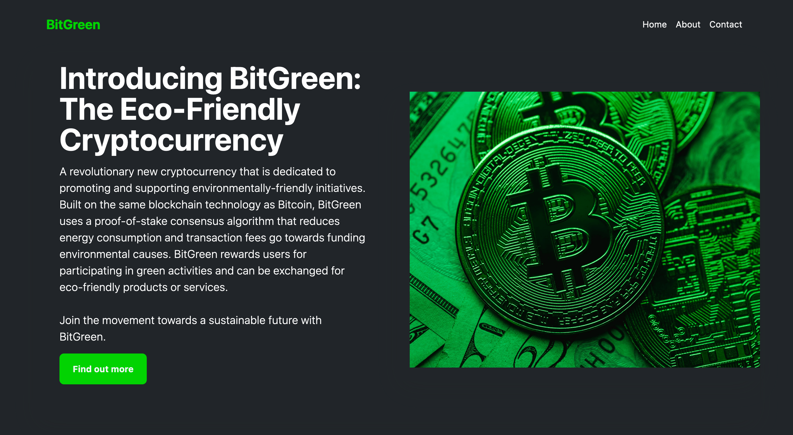

# BitGreen - The Green Coin

## Project Description

BitGreen is the front-end implementation of a fictional cryptocurrency website promoting eco-friendly initiatives. It consists of two sites developed using Bootstrap and Tailwind CSS, showcasing visually appealing and responsive designs.

## Sites

### 1. Bootstrap Site

The Bootstrap site utilizes the Bootstrap framework to create a modern and user-friendly interface for BitGreen. It incorporates Bootstrap's components, grid system, and CSS utilities to achieve a consistent and responsive layout across different devices and screen sizes. The site features a sleek design with intuitive navigation and showcases the various features and benefits of BitGreen.

### 2. Tailwind CSS Site

The Tailwind CSS site showcases the power and flexibility of the Tailwind CSS framework. It leverages Tailwind CSS's utility-first approach to design a visually appealing and highly customizable website. The site demonstrates the use of Tailwind CSS's utility classes to create responsive layouts, apply custom styling, and implement dynamic features. It offers a unique visual experience while maintaining the eco-friendly theme of BitGreen.

## Screenshots

Here are a few screenshots of the BitGreen websites:

## Usage

To explore the BitGreen websites, follow these steps:

1. Clone the repository to your local machine using the following command: `git clone https://github.com/brianlangley/BitGreen`

2. Open the Bootstrap site or Tailwind CSS site folder depending on your preference.

3. Open the `index.html` file in a web browser.

4. Explore the website and interact with its various components.

## License

This project is licensed under the [MIT License](LICENSE).
