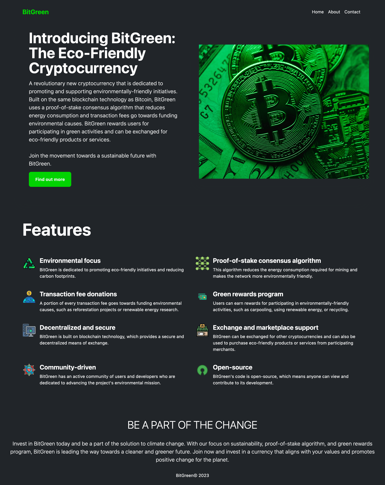

# BitGreen - The Green Coin

## Project Description

BitGreen is the front-end implementation of a fictional cryptocurrency website promoting eco-friendly initiatives. It consists of two sites developed using Bootstrap and Tailwind CSS, showcasing visually appealing and responsive designs.

## Screenshot

## Usage

To explore the BitGreen websites, follow these steps:

1. Clone the repository to your local machine using the following command: `git clone https://github.com/brianlangley/BitGreen`

2. Open the Bootstrap site or Tailwind CSS site folder depending on your preference.

3. Open the `index.html` file in a web browser.

4. Explore the website and interact with its various components.

## License

This project is licensed under the [MIT License](LICENSE).
